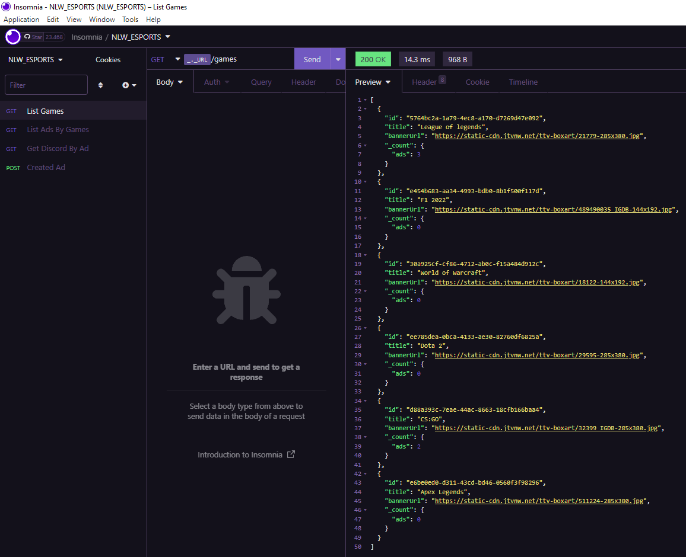
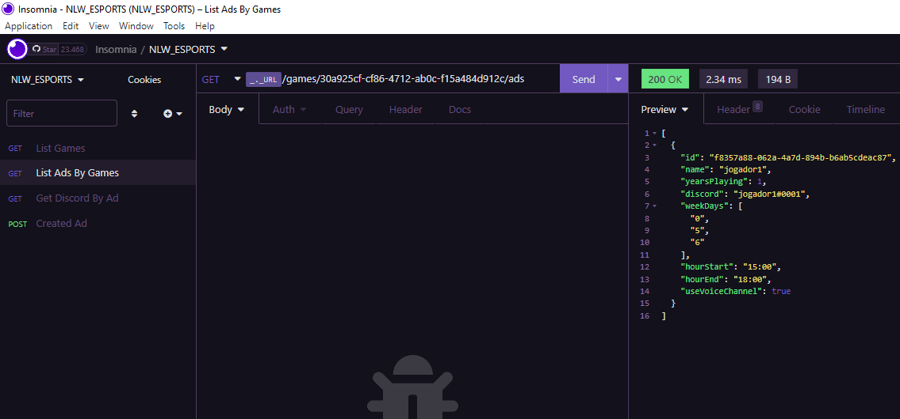
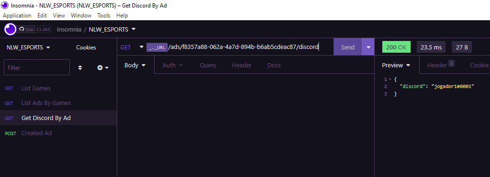
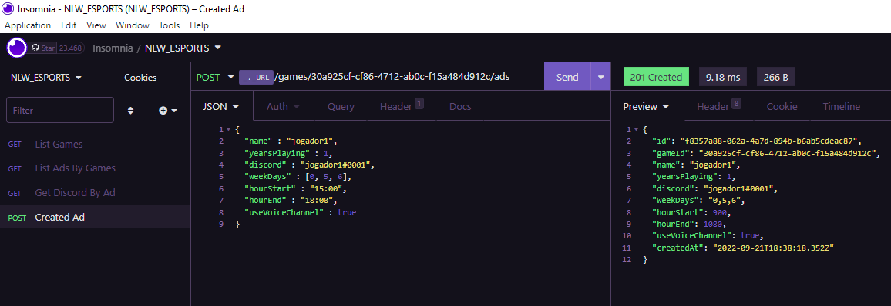
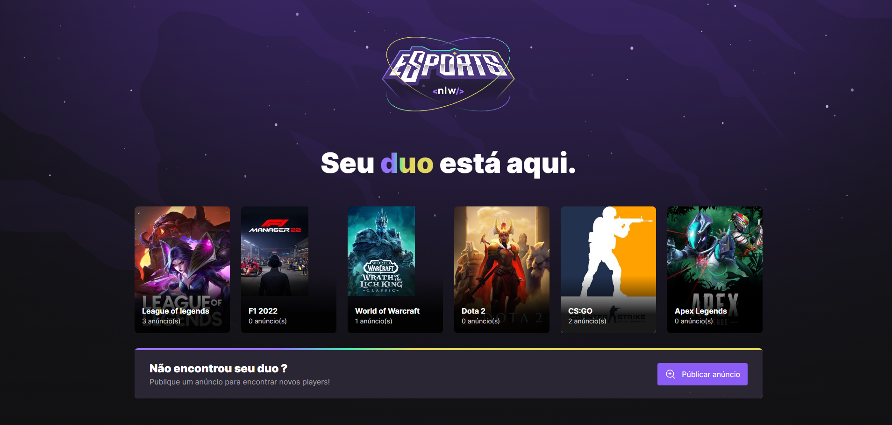
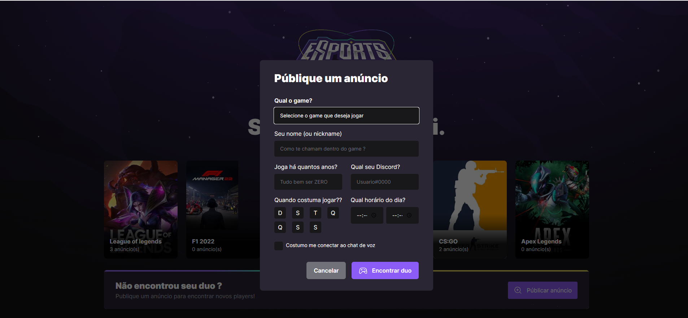
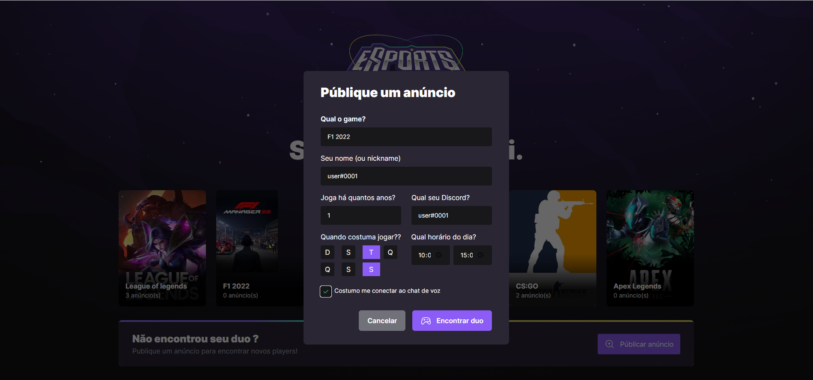
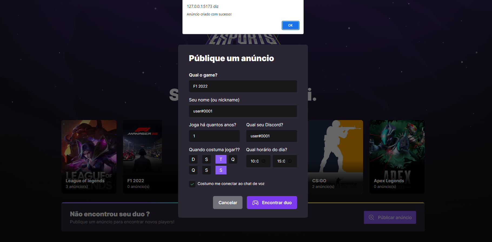
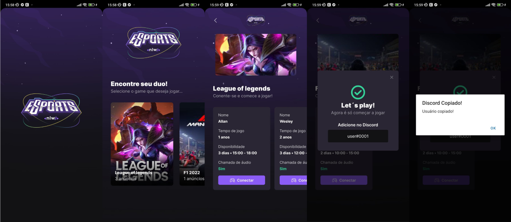

# NLW esports 2022

# Back-end

### Entidades

---
### Game
- id
- title
- bannerUrl

---
### Ad 

- id
- gameId
- name
- yearsPlaying
- discord
- weekDays
- hourStart
- hourEnd
- useVoiceChannel
- createdAt

---
## Caso de uso

- Listagem de games com contagem de anúncios
- Criação do novo anpuncio 
- Listagem de anúncios por game
- Buscar discord pelo ID do anúncio

---
## API

###### Rotas

- List Games

---

- List Ads By Games

---

- Get Discord By Ad

---

- Created Ad

---

## WEB

- Home

---

- Form

---

- Completed Form

---

- Return of creation

---
## MOBILE

